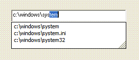

<div align="center">

## AutoComplete textbox and comboboxes like Explorer does


</div>

### Description

Auto-fills a textbox as you type in... Exactly the same way as the textbox/combobox when you execute the Run window. Autocompletes the paths as you type...
 
### More Info
 


<span>             |<span>
---                |---
**Submitted On**   |
**By**             |[Filipe Lage](https://github.com/Planet-Source-Code/PSCIndex/blob/master/ByAuthor/filipe-lage.md)
**Level**          |Intermediate
**User Rating**    |4.9 (79 globes from 16 users)
**Compatibility**  |VB 5\.0, VB 6\.0
**Category**       |[Coding Standards](https://github.com/Planet-Source-Code/PSCIndex/blob/master/ByCategory/coding-standards__1-43.md)
**World**          |[Visual Basic](https://github.com/Planet-Source-Code/PSCIndex/blob/master/ByWorld/visual-basic.md)
**Archive File**   |[](https://github.com/Planet-Source-Code/filipe-lage-autocomplete-textbox-and-comboboxes-like-explorer-does__1-66154/archive/master.zip)

### API Declarations

```
' 2006-08-28
' Revision 2
' Fixed combobox behaviour (thanks to Enmity)
' Enumerated AutoCompleteFlags should be in hex, not decimal as pointed out
' Added a sub to handle for you to call.
' Just use:
'    SetAutoComplete Text1
' or
'    SetAutoComplete ComboBox1
'
' And the function will handle the rest
Private Declare Function SHAutoComplete Lib "shlwapi.dll" (ByVal hWndEdit As Long, ByVal dwFlags As AutoCompleteFlags) As Integer
Private Declare Function FindWindowEx Lib "user32.dll" Alias "FindWindowExA" (ByVal hWnd1 As Long, ByVal hWnd2 As Long, ByVal lpsz1 As String, ByVal lpsz2 As String) As Long
Public Enum AutoCompleteFlags
  SHACF_DEFAULT = &H0
  SHACF_FILESYSTEM = &H1
  SHACF_URLHISTORY = &H2
  SHACF_URLMRU = &H4
  SHACF_USETAB = &H8
  SHACF_URLALL = (SHACF_URLHISTORY Or SHACF_URLMRU)
  SHACF_FILESYS_ONLY = &H10
  SHACF_FILESYS_DIRS = &H20
  SHACF_AUTOSUGGEST_FORCE_ON = &H10000000
  SHACF_AUTOSUGGEST_FORCE_OFF = &H20000000
  SHACF_AUTOAPPEND_FORCE_ON = &H40000000
  SHACF_AUTOAPPEND_FORCE_OFF = &H80000000
End Enum
Private Sub SetAutoCompleteComboBox(ByVal lngHwnd As Long, Optional Opts As AutoCompleteFlags = SHACF_DEFAULT)
' Thanks go to enmity for this fix
Dim o_hwndEdit As Long
o_hwndEdit = FindWindowEx(lngHwnd, 0, "EDIT", vbNullString)
If o_hwndEdit &lt;&gt; 0 Then
  SetAutoCompleteTextBox o_hwndEdit, Opts
  End If
End Sub
Private Sub SetAutoCompleteTextBox(ByVal lngHwnd As Long, Optional Opts As AutoCompleteFlags = SHACF_DEFAULT)
SHAutoComplete lngHwnd, Opts
End Sub
Public Sub SetAutoComplete(obj As Object, Optional Opts As AutoCompleteFlags = SHACF_DEFAULT)
If TypeOf obj Is TextBox Then SetAutoCompleteTextBox obj.hWnd, Opts
If TypeOf obj Is ComboBox Then SetAutoCompleteComboBox obj.hWnd, Opts
End Sub
```


### Source Code

```
Create a form, add a textbox (text1)
Private sub Form_Load()
SetAutoComplete text1
end sub
' Finally, just start entering something like "C:\Windo" in your textbox and you'll notice that it autocompletes with "C:\Windows" (suggested) but you also have a list of possible paths begining with the text you type in.
' Just thought I could share this with you... Can be handy ;)
```

